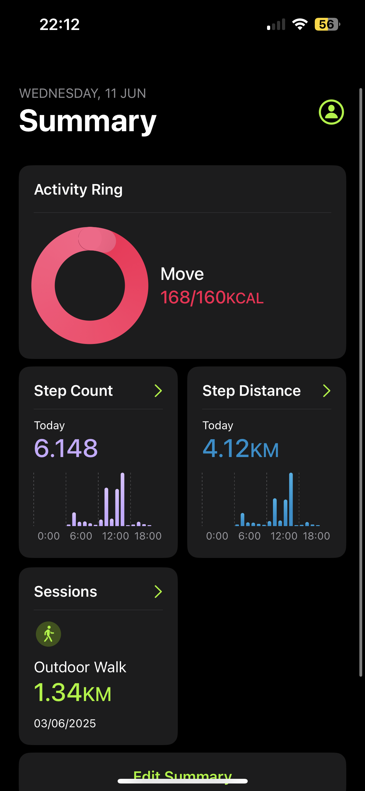
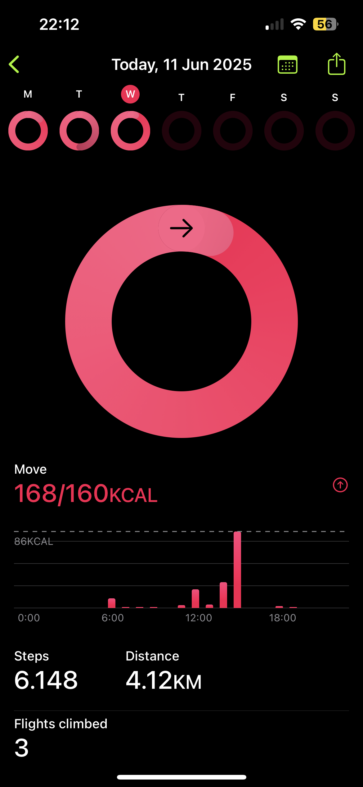
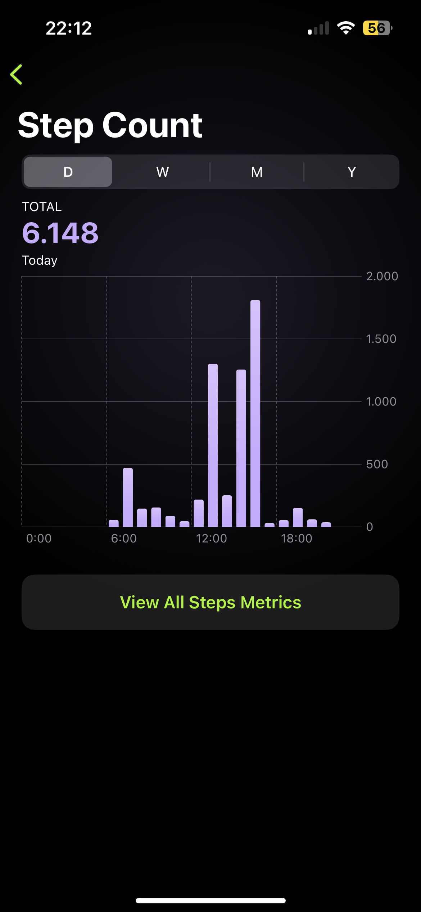
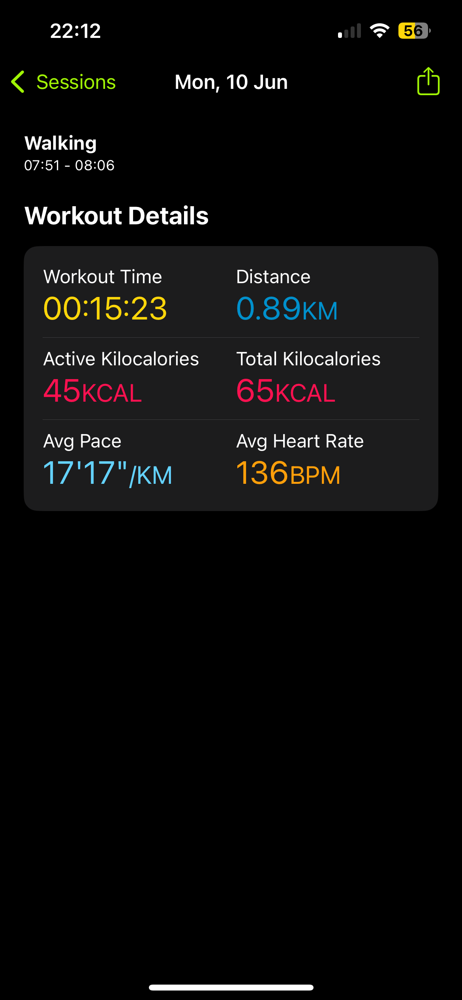

# FitnessClone

FitnessClone is a SwiftUI-based iOS application that mimics the core experience of Apple’s Fitness app by displaying your daily activity rings, steps, distance, and flights climbed. 
Users can also export or share a snapshot of their progress.

I wanted to challenge myself by recreating a polished, real-world app interface and experience:

* **Skill Demonstration**: showcase proficiency in SwiftUI, ChartKit, HealthKit integration and SwiftData.
* **Architectural Practice**: apply MVVM pattern.


## Features

- **Daily Activity Rings**: interactive rings for calories burned.
- **Charts & Stats**: line chart for calorie trends, step count, distance and flights climbed.  
- **Export & Share**: generate and share a snapshot of today’s progress.


## How to Install and Run the Project

1. **Clone the repository**

   ```bash
   git clone https://github.com/Leg3ndEntity/FitnessClone.git
   ```
2. **Open in Xcode**
3. **Build & Run**

   * Select an iOS 17.6+ simulator or device.
   * Run the project (⌘R).
4. **Grant Permissions**

   * On first launch, allow HealthKit access to read activity and fitness data.


## Screenshots

<p float="left">
  
  
  
  
</p>

## Author

[Simone Sarnataro](https://github.com/Leg3ndEntity) · [simone.sarnataro02@gmail.com](simone.sarnataro02@gmail.com)
